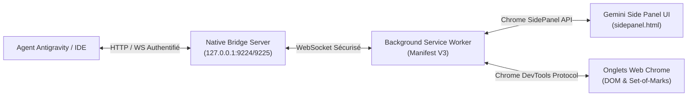

# Antigravity Chrome Side Panel 🌐✨

[](https://developer.chrome.com/docs/extensions/mv3/intro/)
[](https://gemini.google.com)
[](https://python.org)
[](LICENSE)
[](https://julienpiron.fr)

> **Persistent, native Chrome Side Panel extension paired with a local high-performance CDP automation bridge for Google Antigravity & Gemini agents.**

Calqué au pixel près sur l'expérience **Google Gemini** (fond sombre `#131314`, étincelle vectorielle, disposition ergonomique découplée), ce panneau latéral offre un copilote IA docked directement dans votre navigateur, capable de comprendre la page active et d'exécuter des actions concrètes.

---

## ✨ Points Forts & Fonctionnalités Clés

- **🎨 Esthétique Google Gemini 1:1** : Thème sombre moderne, typographie Google Sans, ombre portée douce et disposition en 3 rangées découplées (zéro écrasement de la zone de saisie).
- **🤖 Mode `AGY 2.0 • Auto` (Routage Intelligent)** : Analyse l'intention de votre prompt en temps réel pour router automatiquement vers :
  - **SOTA Direct** : pour les actions techniques (clic, formulaires, capture, cookies, navigation).
  - **Pro Reasoning** : pour les questions denses, comparatifs et analyses techniques complexes.
  - **Flash Extended** : pour les résumés et questions quotidiennes instantanées.
- **📌 Puce de Contexte Dynamique (« Work with Tabs »)** : Détecte et affiche l'onglet actif (`ⓘ [Titre] ✕`). Bouton **`+`** et raccourci **`@`** pour basculer de contexte en un clic parmi tous les onglets ouverts.
- **🎙️ Dictée Vocale Native (Web Speech API)** : Bouton microphone interactif avec pulsation rouge (`pulse-recording`), retranscription en direct et bascule automatique en flèche d'envoi.
- **⚡ Cartographie Set-of-Marks (SoM)** : Injection de badges numérotés `[#1]`, `[#2]` sur tous les éléments cliquables avec exécution directe en un clic sur le panneau.
- **🔒 Pont Local Sécurisé par Jeton** : WebSocket haute performance (`ws://127.0.0.1:9224`) et API REST (`http://127.0.0.1:9225`) reliant votre agent Antigravity au Chrome DevTools Protocol (CDP) sans exposer de port distant.

---

## 🏛️ Architecture



---

## 🚀 Installation & Démarrage Rapide

### 1. Cloner le Dépôt
```bash
git clone https://github.com/pironjulien/antigravity-chrome-sidepanel.git
cd antigravity-chrome-sidepanel
```

### 2. Charger l'Extension dans Google Chrome
1. Ouvrez Chrome et accédez à `chrome://extensions`.
2. Activez le **Mode développeur** (en haut à droite).
3. Cliquez sur **Charger l'extension non empaquetée** (*Load unpacked*).
4. Sélectionnez le dossier `extension/` du dépôt.

### 3. Lancer le Pont Local (Optionnel pour le pilotage agent)
```bash
python native-host/bridge_server.py
```

### 4. Utilisation
- **Ouvrir le panneau latéral** : Cliquez sur l'icône de l'extension ou utilisez le raccourci clavier universel **`Ctrl + Shift + A`**.
- **Changer de contexte d'onglet** : Cliquez sur le bouton `+` ou tapez `@` dans le champ de saisie.
- **Dicter à la voix** : Cliquez sur le microphone et parlez naturellement.

---

## ⌨️ Raccourcis Disponibles

| Raccourci | Action |
| :--- | :--- |
| `Ctrl + Shift + A` | Ouvrir / fermer le Panneau Latéral Chrome |
| `@` | Ouvrir le sélecteur d'onglets de contexte |
| `Entrée` | Envoyer l'instruction au copilote |
| `click #N` | Cliquer directement sur l'élément avec le marqueur Set-of-Mark `#N` |

---

## 👨‍💻 Auteur & Licence

Développé par **Julien Piron** ([julienpiron.fr](https://julienpiron.fr) | X : [@julienpironfr](https://x.com/julienpironfr)).  
Publié sous licence **MIT**. Voir le fichier [LICENSE](LICENSE) pour plus de détails.
