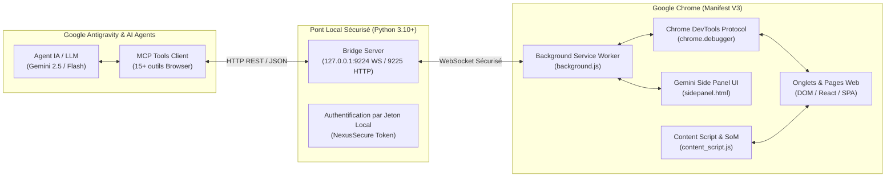

# Antigravity Chrome — Autonomous Browser Use & Web Automation Bridge 🌐🤖✨

[](https://developer.chrome.com/docs/extensions/mv3/intro/)
[](https://modelcontextprotocol.io/)
[](https://gemini.google.com)
[](https://python.org)
[](LICENSE)
[](https://julienpiron.fr)

> **Moteur autonome de Browser Use, remplissage de formulaires et automatisation web Chromium pour Google Antigravity et agents IA. Équipé d'un pont Chrome DevTools Protocol (CDP) temps réel, d'un balisage visuel Set-of-Marks et d'un panneau latéral copilote Google Gemini 1:1.**

Conçu pour égaler et surpasser les meilleures intégrations Browser Use de **Claude** (Claude Computer Use / Browser) et **OpenAI Codex** (Operator / Codex Browser), **Antigravity Chrome** donne à votre agent IA les yeux et les mains nécessaires pour interagir avec le Web de manière 100% autonome et déterministe.

---

## ⚡ En quoi Antigravity Chrome égale & surpasse Claude et Codex

| Fonctionnalité | Claude Computer Use / Plugins Codex | Antigravity Chrome (Ce Projet) |
| :--- | :--- | :--- |
| **Remplissage de formulaires** | Approximation par frappe aveugle | **Saisie déterministe (`fill`, `type_keys`) avec validation d'état DOM et événements natifs React/Vue** |
| **Ancrage visuel (Grounding)** | Vision brute approximative (pixels) | **Arbre d'accessibilité (`axtree`) + Set-of-Marks (SoM) avec badges `[#1]`, `[#2]` dynamiques** |
| **Protocole sous-jacent** | Capture d'écran OS complète | **Chrome DevTools Protocol (CDP) direct via WebSocket local sécurisé (`127.0.0.1:9224`)** |
| **Gestion multi-onglets** | Limitée ou inexistante | **Contrôle total : `list_tabs`, `select_tab`, `new_tab`, `close_tab`, sélecteur rapide `@`** |
| **Extraction de données** | Scraping texte simple | **Dumps d'arbre DOM structuré, console logs en temps réel, cookies de session et export PDF vectoriel** |
| **Interface & Ergonomie** | Boîte noire sans interface | **Panneau latéral natif Chrome MV3 calqué sur Google Gemini (`#131314`), dictée vocale et mode Auto** |

---

## 🚀 Capacités Clés d'Automatisation

### 1. 📝 Remplissage Autonome de Formulaires & Data Entry
- Remplissage automatique de formulaires multi-champs (inputs texte, mots de passe, zones de texte, menus déroulants `<select>`, cases à cocher, boutons radio).
- Déclenchement automatique des événements JavaScript (`input`, `change`, `blur`) indispensables pour les Single Page Applications modernes (React, Next.js, Vue, Angular).
- Gestion des wizards et formulaires multi-étapes avec détection des erreurs de validation et correction itérative.

### 2. 🎯 Clic Déterministe & Navigation Web
- Clics précis par sélecteur CSS, XPath ou coordonnées écran avec ripple laser visuel (`__antigravity_visual_click`).
- Prise en charge des clics sémantiques basés sur le texte visible et le rôle ARIA.
- Défilement intelligent (`scroll`), survol d'éléments (`hover`) pour afficher les menus déroulants et infobulles.
- Navigation multi-onglets (`navigate`, `reload`, `select_tab`, `new_tab`, `close_tab`).

### 3. 🏷️ Set-of-Marks (SoM) & Vision AI Grounding
- Injection instantanée de badges numérotés (`[#1]`, `[#2]`, ...) sur tous les éléments interactifs de la page active (y compris au sein du Shadow DOM récursif).
- Permet aux modèles multimodaux (Gemini 2.5 Pro / Flash, Claude 3.7 Sonnet) de désigner avec une précision absolue l'élément à manipuler, éliminant tout risque d'erreur de sélecteur.

### 4. 🔍 Extraction de Données & Inspection Web
- **Accessibility Tree (`axtree`)** : Extraction de la hiérarchie d'accessibilité compacte pour une compréhension instantanée de la structure logique de la page.
- **Console Logs en direct** : Capture de tous les messages `console.log`, `console.error` et avertissements pour diagnostiquer les erreurs web.
- **Captures d'écran & PDF** : Dumps WebP/PNG optimisés (< 200 Ko) et impression PDF vectorielle native via CDP.
- **Cookies & Sessions** : Lecture et injection de cookies pour la navigation authentifiée sans ré-authentification répétitive.

### 5. 💬 Panneau Latéral Copilote Google Gemini 1:1
- Interface docking native Chrome persistante (`sidepanel.html`), toujours accessible via **`Ctrl + Shift + A`**.
- Thème sombre Google Gemini (`#131314`), typographie fluide Google Sans et étincelle animée.
- **Puce de contexte dynamique (« Work with Tabs »)** : Détection automatique de l'onglet actif avec raccourci `@` et bouton `+`.
- **Dictée vocale native** : Microphone interactif Web Speech API avec pulsation et retranscription en temps réel.
- **Mode `AGY 2.0 • Auto`** : Routage automatique de chaque invite entre modèle SOTA direct, raisonnement approfondi Pro ou vitesse Flash.

---

## 🏛️ Architecture Technique



---

## 🛠️ Catalogue d'Outils pour Agents (Outils MCP / API)

L'agent Antigravity dispose d'une palette complète d'outils pour piloter Chrome :

| Outil | Description |
| :--- | :--- |
| `browser_navigate(url)` | Ouvre ou redirige l'onglet actif vers une URL. |
| `browser_click(selector, index)` | Clique avec précision sur un élément CSS ou un marqueur SoM `[#N]`. |
| `browser_fill(selector, text)` | Remplit un champ de formulaire ou un input avec émission d'événements. |
| `browser_press_key(key)` | Simule l'appui d'une touche (`Enter`, `Tab`, `ArrowDown`, etc.). |
| `browser_select_option(selector, value)` | Sélectionne une valeur dans un menu déroulant `<select>`. |
| `browser_hover(selector)` | Survole un élément pour déclencher les interactions CSS/JS. |
| `browser_scroll(direction, amount)` | Fait défiler la page (`up`, `down`, `top`, `bottom`). |
| `browser_screenshot(format)` | Capture l'affichage de l'onglet actif sous format WebP/PNG compact. |
| `browser_content()` | Extrait le DOM ou le texte brut nettoyé de la page active. |
| `browser_axtree()` | Récupère l'arbre d'accessibilité hiérarchique pour le raisonnement IA. |
| `browser_list_tabs()` | Liste tous les onglets ouverts avec IDs, URLs et titres. |
| `browser_select_tab(tab_id)` | Bascule l'action de l'agent sur un onglet spécifique. |
| `browser_eval(script)` | Exécute une expression JavaScript dans le contexte de la page. |
| `browser_get_cookies()` | Lit les cookies de la session pour la persistance d'authentification. |
| `browser_logs()` | Récupère les logs de la console DevTools de la page. |

---

## 🚀 Installation & Démarrage Rapide

### 1. Cloner le Dépôt
```bash
git clone https://github.com/pironjulien/antigravity-chrome-sidepanel.git
cd antigravity-chrome-sidepanel
```

### 2. Charger l'Extension dans Google Chrome
1. Ouvrez Google Chrome et accédez à `chrome://extensions`.
2. Activez le **Mode développeur** (en haut à droite).
3. Cliquez sur **Charger l'extension non empaquetée** (*Load unpacked*).
4. Sélectionnez le dossier `extension/` du dépôt.

### 3. Lancer le Serveur Pont Local
```bash
python native-host/bridge_server.py
```
> Le serveur écoute sur `ws://127.0.0.1:9224` (WebSocket) et `http://127.0.0.1:9225` (API REST). Il est immédiatement prêt à recevoir les requêtes d'Antigravity.

### 4. Utilisation au Quotidien
- **Raccourci Panneau Latéral** : Appuyez sur **`Ctrl + Shift + A`** pour ouvrir le panneau à tout moment.
- **Sélecteur d'Onglets `@`** : Tapez `@` dans la zone de texte pour cibler un autre onglet ouvert.
- **Dictée Vocale** : Cliquez sur le micro et dictez vos consignes en langage naturel.
- **Automatisation Agent** : Lancez vos tâches depuis Antigravity ; l'agent pilote automatiquement vos onglets Chrome !

---

## ⌨️ Raccourcis Disponibles

| Raccourci | Action |
| :--- | :--- |
| `Ctrl + Shift + A` | Ouvrir / fermer le Panneau Latéral Chrome |
| `@` | Ouvrir le sélecteur d'onglets de contexte |
| `Entrée` | Envoyer l'instruction au copilote |
| `click #N` | Cliquer directement sur l'élément avec le marqueur Set-of-Mark `#N` |

---

## 👨‍💻 Auteur & Licence

Développé par **Julien Piron** ([julienpiron.fr](https://julienpiron.fr) | X : [@julienpironfr](https://x.com/julienpironfr)).  
Publié sous licence **MIT**. Voir le fichier [LICENSE](LICENSE) pour plus de détails.
